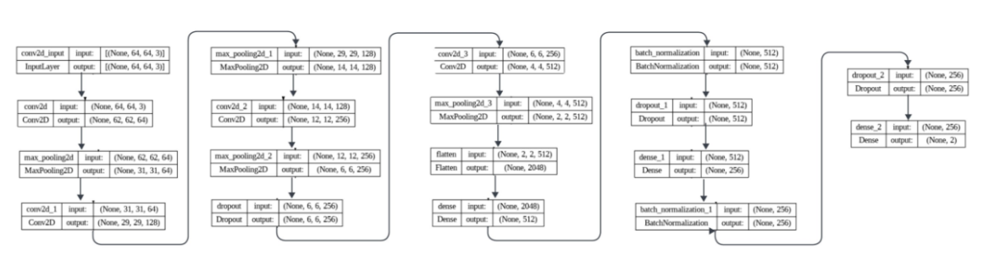
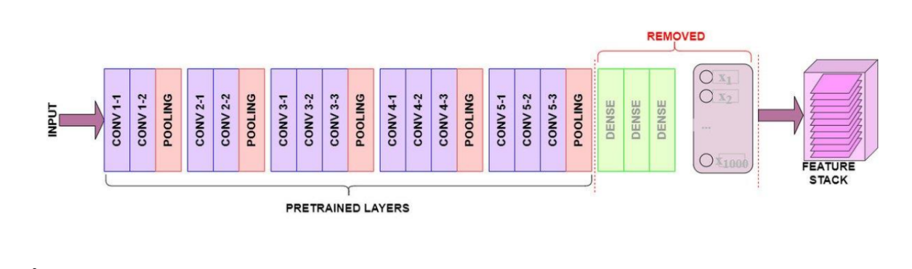

# **📸 Classification de Visages Avec et Sans Masque**

Ce projet explore différents modèles de réseaux de neurones convolutifs pour la classification d'images, en mettant l'accent sur la différenciation entre les visages avec et sans masque facial.

---

## **1. 📝 Description du Projet**
- 🔍 Utilisation de la base de données *Face Mask* pour entraîner et évaluer les modèles.
- 🛠️ Les données sont prétraitées via des techniques de redimensionnement, normalisation et augmentation pour améliorer la qualité de l'entraînement.
- 📊 Plusieurs modèles, entraînés à partir de zéro ou basés sur le transfert d'apprentissage, sont comparés pour leurs performances respectives.

---

## **2. 🧠 Modèles Utilisés**

### **⚙️ Modèles "From Scratch"**
1. **SGD (Stochastic Gradient Descent)**  
   - ✅ **Avantage** : Flexibilité.  
   - ❌ **Inconvénient** : Performance limitée.

2. **Adam**  
   - ✅ **Avantage** : Haute précision pour la reconnaissance faciale.  
   - ❌ **Inconvénient** : Faible performance pour la détection de masque facial.

   

### **📦 Modèles Préentraînés (Transfert d'Apprentissage)**
3. **ResNet50**  
   - ✅ **Avantage** : Haute précision pour la détection de masque facial.  
   - ❌ **Inconvénient** : Performance relativement faible pour la reconnaissance faciale.  
   - 🖼️ **Architecture :**

     

4. **VGG16 avec `include_top=True`**  
   - ✅ **Avantage** : Haute précision pour la reconnaissance faciale.  
   - ❌ **Inconvénient** : Moins performant pour la détection de masque facial.  
   - 🖼️ **Architecture :**  
     

5. **VGG16 avec `include_top=False`**  
   - ✅ **Avantage** : Meilleure précision globale pour la détection de masque facial et la reconnaissance faciale.  
   - 🖼️ **Architecture :**
   
     

---

## **3. 📊 Résultats Comparatifs**

| **Modèle**                   | **Accuracy (Visage)** | **Accuracy (Masque)** |
|-------------------------------|-----------------------|------------------------|
| ⚙️ SGD                        | 51.21%               | 81.17%                |
| ⚙️ Adam                       | 98.81%               | 34.77%                |
| 🖼️ ResNet50                   | 71.22%               | 97.31%                |
| 🖼️ VGG16 `include_top=True`   | 97.08%               | 82.22%                |
| 🖼️ VGG16 `include_top=False`  | 97.08%               | **98.07%**            |

### **🔎 Analyse Comparative**
- **🏆 Meilleur modèle pour la détection de masque facial** : *VGG16 avec `include_top=False`*.
- **💡 Points clés** : Ce modèle offre une précision équilibrée et performante pour les deux tâches : détection de masque facial et reconnaissance faciale.

---

## **4. ✅ Conclusion**

Le modèle **VGG16 avec `include_top=False`** est recommandé pour les tâches de classification des visages avec ou sans masque facial. Il combine :  
- 🌟 Une excellente précision pour la détection de masque facial (**98.07%**).  
- 🌟 Une performance élevée pour la reconnaissance faciale (**97.08%**).  

Si la détection de masque est une priorité, ce modèle constitue le meilleur choix. 🏅

---

## **5. 💻 Technologies Utilisées**
- **Langage** : Python 
- **Frameworks** : TensorFlow, Keras  
- **Modèles Préentraînés** : ResNet50, VGG16

---

## **6. ✍️ Auteur**
Ce projet a été réalisé dans le cadre d'une exploration approfondie des modèles de classification d'images en deep learning.

